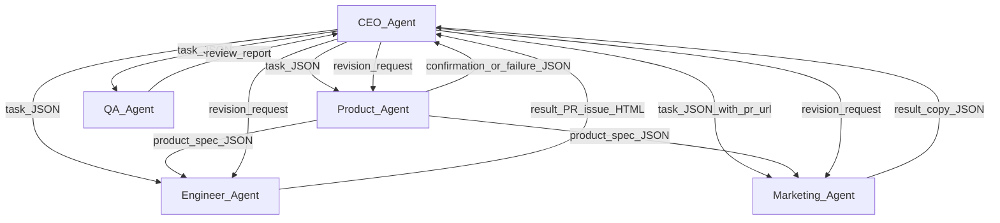
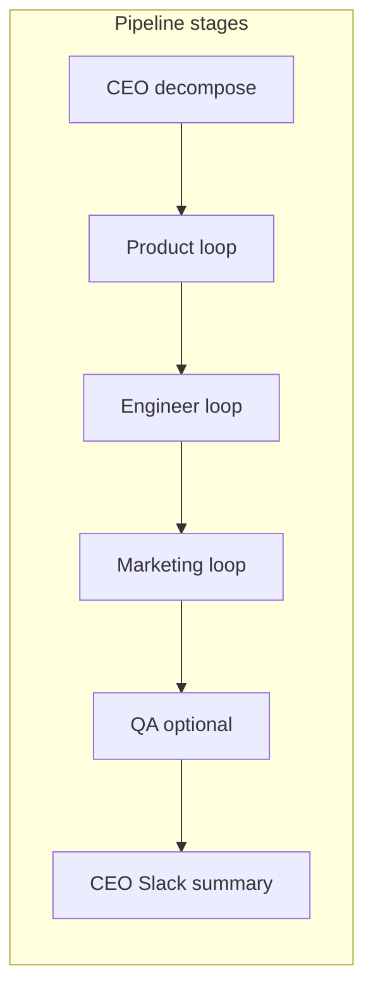

# LaunchMind

Multi-agent system for **FAST-NUCES Agentic AI — Group Assignment**. Autonomous LLM agents collaborate via a structured JSON **message bus** to turn a startup idea into a product spec, a GitHub landing-page PR, marketing email + Slack launch post, optional QA review comments, and a CEO final Slack summary.

## Startup idea (2–3 sentences)

**LinkedIn cold-outreach copilot** — a tool that auto-generates cold emails for sales teams using LinkedIn profile data (role, company, headline, and activity signals). Reps spend less time researching and drafting first-touch copy while keeping messages specific enough to feel one-to-one. The goal is higher reply rates without resorting to generic blast templates.

You can run the pipeline with a different idea anytime: pass a string argument to `main.py` or set `STARTUP_IDEA` in `.env` (see Setup below).

## Agent architecture

**Who messages whom** (message types include `task`, `result`, `confirmation`, `revision_request`, `failure`):



**Runtime order in `main.py`** (after CEO decomposition):



- **Message bus**: [`scripts/message_bus.py`](scripts/message_bus.py) — **Redis is required** for this project: set **`LAUNCHMIND_REDIS_URL`** in `.env`. Uses LISTs per agent, append-only history, and **`PUBLISH`** on `{prefix}:bus`. Every message includes `message_id`, `from_agent`, `to_agent`, `message_type`, `payload`, `timestamp`, optional `parent_message_id`. (Without that URL the code falls back to an in-process bus for local debugging only.)
- **Product failures**: LLM/validation errors send a **`failure`** message to the CEO queue; `main.py` logs it, appends to `decision_log`, and **re-tasks** Product up to `LAUNCHMIND_MAX_PRODUCT_ATTEMPTS`.
- **CEO** uses an LLM to **decompose** the idea into role-specific focuses (not hardcoded) and **reviews** Product / Engineer / Marketing outputs; may send **`revision_request`** messages. Posts a **Block Kit** final summary to Slack.
- **Product** emits the required spec schema to Engineer and Marketing and confirms to CEO.
- **Engineer** creates GitHub issue **“Initial landing page”**, branch, `index.html` commit (author `EngineerAgent <agent@launchmind.ai>`), and opens a **PR** via REST API.
- **Marketing** uses SendGrid + **Slack Block Kit** on `#launches` (tagline, one-line description, PR link). Waits for **PR URL from CEO** before sending email/Slack.
- **QA** (enable with `ENABLE_QA=true`) reviews HTML + marketing copy and adds **≥2 inline PR comments** on `index.html`.

## Platforms

| Platform | What agents do |
|----------|----------------|
| **OpenAI** (or optional **Anthropic** for CEO) | LLM reasoning in all agents; set `CEO_LLM_PROVIDER=anthropic` + `ANTHROPIC_API_KEY` for multi-provider bonus. |
| **GitHub** | **Engineer**: REST API — issue, branch, commit, open/update PR. **QA**: REST API — fetch PR files, post **inline review comments** on `index.html` (and related review payloads). |
| **Slack** | Marketing launch blocks; CEO final summary blocks. |
| **SendGrid** | Cold outreach email (LLM subject/body) to `MARKETING_TO_EMAIL`. |
| **Redis** | **Required** — message bus storage + pub/sub (`LAUNCHMIND_REDIS_URL`); see [Redis with Docker and inspecting bus history](#redis-with-docker-and-inspecting-bus-history). |

## Repository layout

- `main.py` — entry point.
- `scripts/message_bus.py` — shared messaging (in-process or Redis).
- `scripts/llm_client.py` — OpenAI / optional Anthropic routing.
- `scripts/slack_util.py` — Slack channel + API headers.
- `agents/` — `ceo_agent.py`, `product_agent.py`, `engineer_agent.py`, `marketing_agent.py`, `qa_agent.py`.
- `scripts/verify_platforms.py` — smoke-test credentials.
- `.env.example` — required environment variables (copy to `.env`).

## Setup

For a **step-by-step pipeline setup** (GitHub, Slack, SendGrid, OpenAI, `.env`, verify script, run), see **[`SETUP.md`](SETUP.md)**.

1. **Create** a public GitHub repo named `launchmind-[your-group-name]`, a Slack workspace with app scopes `chat:write`, `channels:read`, `channels:join`, channel `#launches`, and a SendGrid account with a **verified sender**.
2. **Clone** this repository and create a virtual environment (recommended).
3. **Install dependencies**

   ```bash
   pip install -r requirements.txt
   ```

4. **Copy** `.env.example` to `.env` and fill real values. Never commit `.env`.
5. **Verify** APIs (optional):

   ```bash
   python scripts/verify_platforms.py
   ```

6. **Run** the full pipeline:

   ```bash
   python main.py "Your startup idea in plain text"
   ```

   Or rely on `STARTUP_IDEA` in `.env` or the built-in default idea in `main.py`.

## Environment variables

See `.env.example`. Critical: `GITHUB_TOKEN`, `GITHUB_REPO` (`owner/name`), `SLACK_BOT_TOKEN`, `SLACK_CHANNEL`, `SENDGRID_API_KEY`, `SENDGRID_FROM_EMAIL`, `MARKETING_TO_EMAIL`, `OPENAI_API_KEY`, **`LAUNCHMIND_REDIS_URL`** (or `REDIS_URL`) — **required** for the Redis message bus.

Optional: `ENGINEER_BRANCH` (default `agent-landing-page`), `GITHUB_DEFAULT_BRANCH` (default `main`), `ENABLE_QA` (default `true`; set `false` to skip QA), `OPENAI_MODEL`, Anthropic keys for CEO, **`LAUNCHMIND_REDIS_PREFIX`** (default `launchmind`).

## Redis with Docker and inspecting bus history

You **must** set **`LAUNCHMIND_REDIS_URL=redis://localhost:6379/0`** (or your host/port/DB) in `.env` and run Redis locally. Example with Docker:

**Start Redis** (names the container `redis` so the next command stays stable):

```bash
docker run -d --name redis -p 6379:6379 redis:7
```

If you already started Redis without `--name`, run **`docker ps`** and use the **NAMES** column (e.g. `heuristic_dewdney`) instead of `redis` below.

**Open `redis-cli` inside the container:**

```bash
docker exec -it redis redis-cli
```

**Inspect LaunchMind message history** (default prefix `launchmind`; use `SELECT 1` if your URL ends with `/1` instead of `/0`):

```redis
SELECT 0
LLEN launchmind:history
LRANGE launchmind:history 0 -1
```

Each `LRANGE` entry is one JSON message. Per-agent queues are `launchmind:queue:ceo`, `launchmind:queue:product`, etc. To watch live **`PUBLISH`** traffic from the app, run **`SUBSCRIBE launchmind:bus`** in another `redis-cli` session while `main.py` runs.

## Slack workspace and demo evidence

**Before submission, replace the bullets below with your group’s evidence.**

- **Workspace invite link:** In Slack: workspace name → **Invite people** → **Copy invite link**, or use **Settings & administration** → **Workspace settings** → invite link. Paste here:  
  `https://join.slack.com/t/...` *(your link)*
- **Screenshots (optional but recommended):** Capture `#launches` showing the Marketing Block Kit post and the CEO final summary, or attach images in your course submission if the README is exported as PDF.

## Engineer pull request

**After a successful `main.py` run, paste the Engineer agent’s PR URL here.**

- **Latest PR:** `https://github.com/<owner>/<repo>/pull/<number>`  
  *(Copy from the `[Engineer] Opened PR:` line in the terminal or from the PR page on GitHub.)*

## Demo video checklist (8–10 minutes, live run)

1. Terminal visible while running `python main.py "..."`.
2. CEO decomposition and messages printed / visible in logs.
3. Product spec generation.
4. GitHub: refresh showing **new PR** and branch.
5. Email inbox showing the SendGrid message.
6. Slack showing **Block Kit** launch post and CEO final summary.
7. At least one **feedback loop** (CEO `revision_request` or QA fail → Engineer revision).
8. No log playback — real-time run.

**Windows console tip:** If you see `UnicodeEncodeError` / `charmap` when printing bus traces, either set `PYTHONUTF8=1` before running Python, or set `LAUNCHMIND_TRACE_BUS=0` in `.env` to disable `[BUS]` lines (see `scripts/message_bus.py`).

Record the screen, upload (YouTube/Drive), and submit the link with the repo URL and **group member → agent ownership** on the course portal.

## Group member → agent ownership

**Replace the example rows below** before submission — each member should own at least one agent.

| Member | Agent(s) |
|--------|----------|
| *(your name)* | e.g. CEO |
| *(your name)* | e.g. Engineer |
| *(your name)* | e.g. Product, QA |

## Academic integrity

This project is for coursework. Use only API keys and accounts you are authorized to use; send marketing email only to addresses you control.
